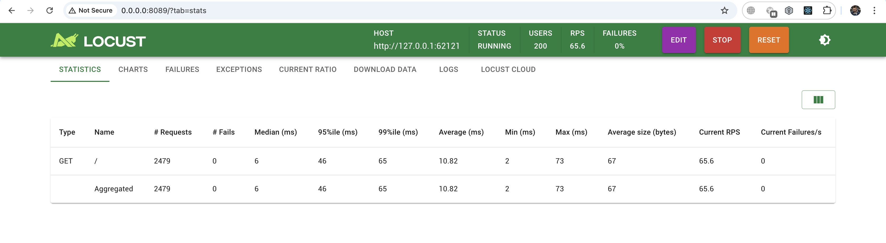
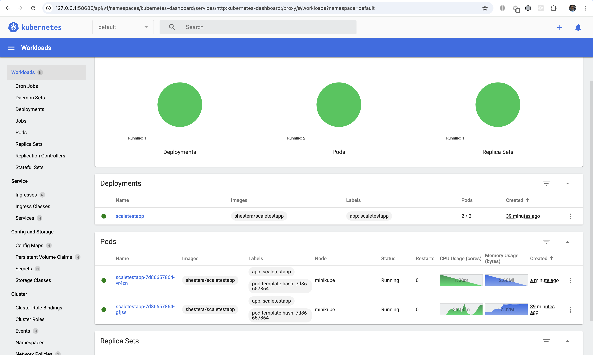
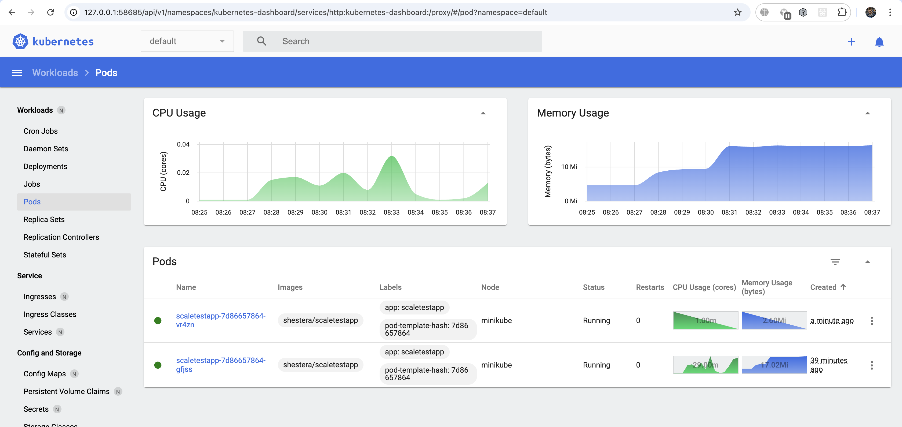

### Start cluster

```bash
minikube start --force --driver=docker --alsologtostderr
```

### Enable metrics-server

```bash
minikube addons enable metrics-server
kubectl get deployment metrics-server -n kube-system
```

### Create deployment

```bash
kubectl apply -f deployment.yml
kubectl get pods
```

### Create service and run tunnel

```bash
kubectl apply -f service.yml
kubectl get svc                             # scaletestapp-service NodePort 10.110.32.108 8080:31507/TCP
minikube service scaletestapp-service --url # http://127.0.0.1:62121
```

### Apply HPA

```bash
kubectl apply -f hpa.yml
kubectl get hpa
```

### Generate load

```bash
curl http://127.0.0.1:62121/
Идентификатор пода: scaletestapp-7d86657864-gfjss
```

```bash
locust
```




```
minikube dashboard
```





```bash
kubectl get hpa
NAME               REFERENCE                 TARGETS           MINPODS   MAXPODS   REPLICAS   AGE
scaletestapp-hpa   Deployment/scaletestapp   memory: 43%/50%   1         10        2          36m
```

```bash
kubectl get pods
NAME                            READY   STATUS    RESTARTS   AGE
scaletestapp-7d86657864-gfjss   1/1     Running   0          40m
scaletestapp-7d86657864-vr4zn   1/1     Running   0          2m16s
```


